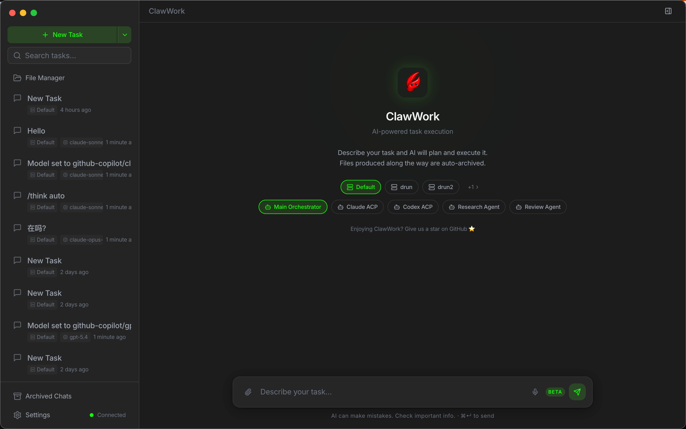

<div align="center">
  

  <h1>ClawWork</h1>
  <p><em>Stop chatting with agents in Telegram, Feishu - The dedicated desktop client for <a href="https://github.com/openclaw/openclaw">OpenClaw</a></em></p>

  <p>
    <a href="https://github.com/clawwork-ai/clawwork/releases"></a>
    <a href="https://github.com/clawwork-ai/clawwork/blob/main/LICENSE"></a>
    <a href="https://github.com/clawwork-ai/clawwork/issues"></a>
    
    
  </p>

  <p>
    <a href="https://github.com/clawwork-ai/clawwork/releases/latest">
      
    </a>
    &nbsp;
    <a href="#install-with-homebrew">
      
    </a>
  </p>
</div>

---

A Client for [OpenClaw](https://github.com/openclaw/openclaw) — Connect ClawWork to your own OpenClaw and unlock **_10x_** multi-session productivity.

## Features

- **Three-column layout** — Task list, conversation, and progress/artifacts panel
- **Multi-task parallel** — Run multiple AI tasks simultaneously with isolated sessions
- **Structured progress** — Real-time tool call visualization and step tracking
- **Local-first artifacts** — AI outputs auto-saved to a local Git repo, searchable and versioned
- **Full-text search** — SQLite FTS5 across tasks, messages, and files
- **Dark / Light theme** — CSS variable driven, switchable at runtime

## Prerequisites

- [Node.js](https://nodejs.org/) >= 20
- [pnpm](https://pnpm.io/) >= 9
- A running [OpenClaw](https://github.com/openclaw/openclaw) server (Gateway on port 18789)

## Quick Start

```bash
## Install with Homebrew

brew tap clawwork-ai/clawwork
brew install --cask clawwork
```

## Build

```bash
# macOS (arm64)
pnpm --filter @clawwork/desktop build:mac:arm64

# macOS (x64)
pnpm --filter @clawwork/desktop build:mac:x64

# macOS (Universal Binary)
pnpm --filter @clawwork/desktop build:mac:universal

# Windows
pnpm --filter @clawwork/desktop build:win
```

Output: `packages/desktop/dist/ClawWork-<version>-<arch>.dmg`

> The DMG is unsigned. Right-click and select "Open" on first launch.

```bash
sudo xattr -rd com.apple.quarantine "/Applications/ClawWork.app"
```

## Tech Stack

| Layer         | Technology                              |
| ------------- | --------------------------------------- |
| Framework     | Electron 34, electron-vite 3            |
| Frontend      | React 19, TypeScript 5, Tailwind CSS v4 |
| UI Components | shadcn/ui (Radix UI + cva)              |
| Animation     | Framer Motion                           |
| State         | Zustand 5                               |
| Database      | better-sqlite3 + Drizzle ORM            |
| Git           | simple-git                              |

## Project Structure

```bash
packages/
  shared/     # @clawwork/shared — types, protocol, constants (zero dependencies)
  desktop/    # @clawwork/desktop — Electron app
    src/
      main/       # Main process: WS client, IPC, DB, workspace
      preload/    # Context bridge API
      renderer/   # React UI: stores, components, layouts
```

## Contributing

Contributions are welcome. For issue and pull request expectations, see [CONTRIBUTING.md](./CONTRIBUTING.md).

## License

[Apache-2.0](./LICENSE)
